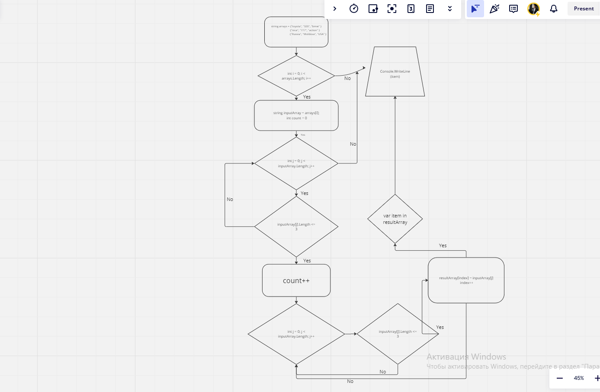

# Test
>  Масив
```C#
string[][] arrays = new string[][]
{
    new string[] {"toyota", "320", "bmw" },
    new string[] {"nice", "777", "action" },
    new string[] {"Russia", "Moldova", "USA" }
};
```
> Обработка каждого массива
```C#
for (int i = 0; i < arrays.Length; i++)
        
string[] inputArray = arrays[i];
int count = 0;
```
> Определение размера нового массива
```C#
for (int j = 0; j < inputArray.Length; j++)
{
    if (inputArray[j].Length <= 3)
    {
         count++;
    }
}
```
> Создание нового массива
```C#
string[] resultArray = new string[count];
int index = 0;
```
> Заполнение нового массива подходящими строками
```C#
for (int j = 0; j < inputArray.Length; j++)
    {
        if (inputArray[j].Length <= 3)
        {
            resultArray[index] = inputArray[j];
            index++;
        }
    }
```
> Вывод результата для текущего массива
```C#
Console.WriteLine("Результат для массива " + (i + 1) + ":");
            foreach (var item in resultArray)
            {
                Console.WriteLine(item);
            }
        Console.WriteLine();  Пустая строка для разделения результатов
```
> Пример блок-схемы

